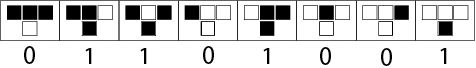
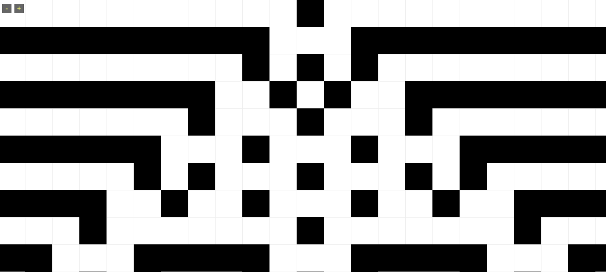

## Automatas celulares elementales

### Regla 110

De especial interés.  Entre el límite del caos y la estabilidad. Similar al Juego de la Vida de Conway.  Cumple con el test de Turing, lo que implica que puede ser usado para simular o realizar cualquier computación.

### Regla 30

Altamente caótico, Puede ser usado como generador de números aleatorios.

### Regla 60

Comportamiento fractal con una célula en el estado inicial. Comportamiento aleatorio con condiciones aleatorias en el estado inicial.

### Regla 90

Autómata celular fractal, produce una pirámide de triangulos.

### Regla 94

Comportamiento aleatorio con simples condiciones iniciales.  

### Regla 54

Se conjetura que es un autómata universal ( cumple con el test de Turing ) pero no se ha comprobado. Muestra un comportamiento interesante con estado inicial aleatorio

### Regla 105

Simplemente un interés personal en este ;).

